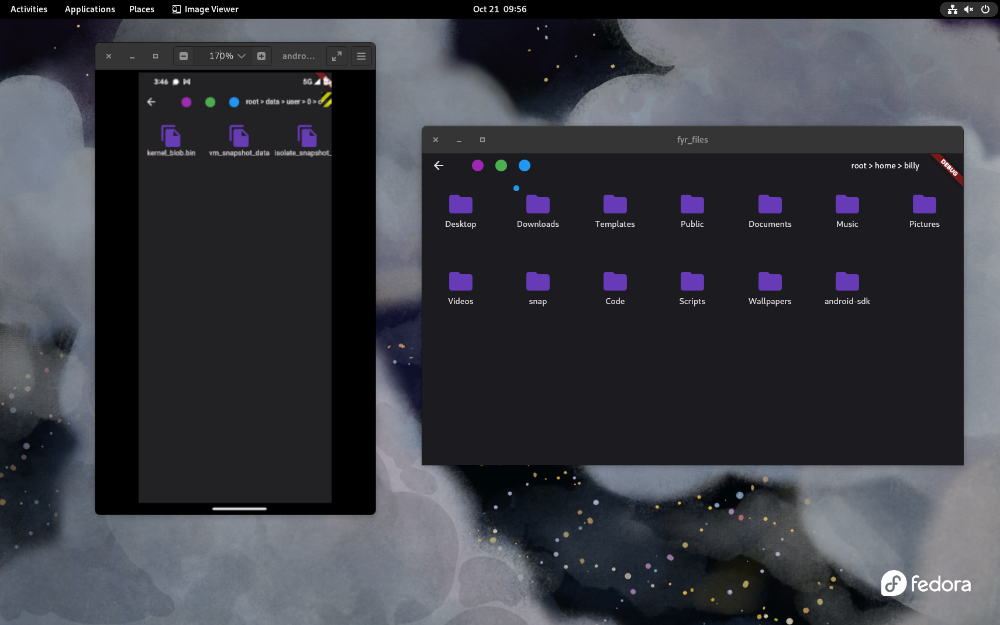
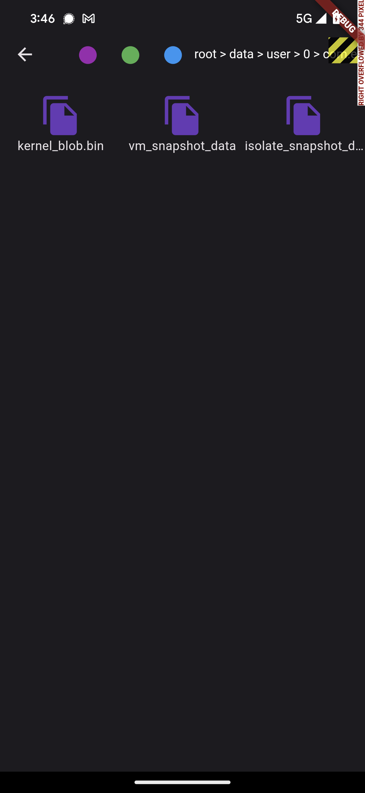

# fyrFiles

fyrFiles is a Linux/Android file manager written with Flutter/Dart. It is minimal but has the traditional functionality of copy/paste, creating new directories/files, viewing properties, and the ability to view hidden files by hitting Ctrl+H.

The biggest feature of fyrFiles is its ability to tag files and filter to view all of your tagged files at once, making it easy to find the files you need when you need them the most. Tags are saved in the ~/.fyr directory under files/tags.json and can easily be moved between devices by simply copying that directory over.

